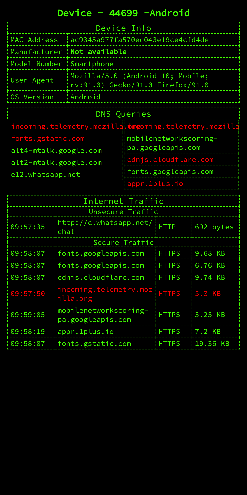

# Project UNVEIL

## Introduction

In the past few years, numerous privacy vulnerabilities have been discovered in the WiFi standards and their implementations for mobile devices. These vulnerabilities allow an attacker to collect large amounts of data on the device user, which could be used to infer sensitive information such as religion, gender, and sexual orientation. Solutions for these vulnerabilities are often hard to design and typically require many years to be widely adopted, leaving many devices at risk.

Project UNVEIL presents an interactive and extendable platform to demonstrate the consequences of these attacks. The platform performs passive and active attacks on smartphones to collect and analyze data leaked through WiFi and communicate the analysis results to users through simple and interactive visualizations.

The platform currently performs two attacks. First, it captures probe requests sent by nearby devices and combines them with public WiFi location databases to generate a map of locations previously visited by the device users. Second, it creates rogue access points with SSIDs of popular public WiFis (e.g. _Heathrow WiFi, Railways WiFi) and records the resulting internet traffic. This data is then analyzed and presented in a format that highlights the privacy leakage. The platform has been designed to be easily extendable to include more attacks and to be easily deployable in public spaces. We hope that UNVEIL will help raise public awareness of privacy risks of WiFi networks.

The work was published as a [demo paper](https://dl.acm.org/doi/10.1145/3308558.3314143) in [The Web Conference 2019 (WWW '19)](https://www2019.thewebconf.org/).

This repository began as the code for deployment of [UNVEIL](https://dl.acm.org/doi/10.1145/3308558.3314143) on any platform with docker. Now, this also contains newer updates made to the platform, including mobile support.

## Frontend usage instructions

UNVEIL provides a frontend interface to control the platform, accessible via a browser (has been tested with Chrome and Firefox).

### Control screen


`localhost:3000/control`

UNVEIL experiment can be controlled via a control screen available at above URL. You need to enter the PIN to access the screen. This is PIN has to be set in the backend during deployment, more details in [deployment section](#deployment).


Once you enter the control screen you can see the buttons to:

- start the experiment i.e. start collecting data from raspberry pis.
- show setup and experiment steps on the [setup screen](#setup-screen)
- show data on [probe screen](#probe-screen)
- show data on [devices screen](#devices-screen)


Once the demo is started, we can see the button change.


Once there is some device connected to the access point, you can select the position on which you want the data to be displayed and can further toggle the data to be shown. It is important note that data is analyzed and shown in real time. This will be visible on `data/{position}`.

You can also see fake data by clicking on `fake` option and this will be visible on `data/0`.

### [Setup screen](#setup-screen)


`localhost:3000/setup`

Setup screen shows how the wifi works for general public to understand and experimental setup that includes the arrangement of raspberry pis and the devices. This has been built according to the [Data Observatory](https://www.imperial.ac.uk/data-science/data-observatory/) at [Imperial College London](https://www.imperial.ac.uk).

### [Probe screen](#probe-screen)


`localhost:3000/probe`

Probe screen shows the summary of the probe requests captured. More details are available in our [paper](https://dl.acm.org/doi/10.1145/3308558.3314143).

### [Devices screen](#devices-screen)



`localhost:3000/data/{0-5}`

These show the data from the devices that was captured when they were connected to our access point. More details in our [paper](https://dl.acm.org/doi/10.1145/3308558.3314143). Additionally, we also now provide details on trackers which can be enabled through the control screen and shown in red.

`localhost:3000/screenshots`

These are the screenshots of the HTTP URLs accessed by the connected devices. This screen also contains some news articles on the WiFi attacks that have happened in the past.

## System architecture


The UNVEIL platform is designed to be modular and easily extendable. It is structured into three main components:

- Raspberry Pi(s): to collect data and perform the attack. [Code](https://github.com/computationalprivacy/unveil-pi-data-collector). We use [opennds](https://github.com/openNDS/openNDS) as a captive portal to collect consent before any data collection happens.
- Backend Server: responsible for managing the demonstration, components, data, and analyses in the experiment. It uses [Redis](https://redis.io/), [MongoDB](https://www.mongodb.com/), [PostgreSQL](https://www.postgresql.org/) and [Django](https://www.djangoproject.com/) in the backend. [EasyList](https://easylist.to/) is used to identify the trackers. [Code](https://github.com/computationalprivacy/unveil-backend).
- Visualization Server: for serving the web pages that visualize the results of data analyses and allow to control the demonstration. Built using [React](https://reactjs.org/) framework. [Code](https://github.com/computationalprivacy/unveil-frontend).

### External APIs used

We use certain external APIs for the platform to work correctly. You need to create accounts for this APIs and provide credentials during deployment.

1. [Google APIs](https://console.developers.google.com/apis/dashboard) for Spreadheet that stores the opted-out MAC addresses.
2. [Wigle API](https://api.wigle.net/) for fetching addresses of WiFi Access Points.

## [Deployment](#deployment)

### Requirements

1. A server with [docker engine](https://docs.docker.com/engine/) and [docker-compose](https://docs.docker.com/compose/) installed to deploy frontend and backend services. This repository contains all the code needed for server deployments
2. [Raspberry Pi(s)](https://www.raspberrypi.org/) with an external antenna (we use [Alfa Network AWUS036NHA](https://www.alfa.com.tw/products_detail/7.htm) for our internal testing). The [unveil-data-collector](https://github.com/computationalprivacy/unveil-pi-data-collector) contains the code and details for deploying a raspberry pi with UNVEIL.

**Note: You can run and test the platform even without raspberry pi. We provide fake data for the same purpose.**

### Configuration files

You can find all the configuration files in `configs` folder of the repository.

1. `google_api_creds.json`: Contains Google API credentials to use for accessing spreadsheets containing opted out MAC addresses.
2. `production.py`: Settings file for Django backend service. Set the Spreadsheet ID for optout of MAC addresses and other settings.
3. `runtimeConfig.js`: Contains configuration for frontend. Provide the backend details that frontend should connect to and center of the map when the system starts. By default it is set to London.

Before deploying:

- check the docker compose file and all volumes being mounted,
- set all the parameters as per the requirements, and
- do change the password for `redis`, and update the `production.py` accordingly.

### Commands

#### Copy configuration files

```shell
cp ./configs/change_me.google_api_creds.json ./configs/google_api_creds.json
cp ./configs/change_me.production.py ./configs/production.py
cp ./configs/change_me.runtimeConfig.js ./configs/runtimeConfig.js
```

Make changes to the configuration files as required.

#### Deploy docker

```shell
# build the images
sudo docker-compose -f unveil-deployment.yml build

# create db folder
mkdir db
mkdir db/mongodata

# create folder for logs
mkdir logs

# start the containers
sudo docker-compose -f unveil-deployment.yml up
```

### Deploy Raspberry Pi

Instructions to setup the Raspberry Pi can be found in [this repository](https://github.com/computationalprivacy/unveil-pi-data-collector).

After setting up the Pi, you will need to register the Pi in the postgres database. This can be done by manually creating a record in the table `security_manager_accesstokens`. You have to add a name for the Pi and corresponding access token, which is to be added in the configuration of the Pi as well.

To register the Pi you can use the following command to open SQL command line interface (when the backend server is up and running):

```bash
sudo docker-compose -f unveil-deployment.yml exec postgres psql -U postgres -d wifi # open sql commandline interface
```

And then use the following command to add a autherisation token and pi name:

```sql
INSERT into security_manager_accesstokens (service,token) VALUES ('<pi_name>', '<auth_token>');
```

Remember to add this authentication token to the [pi-data-collector](https://github.com/computationalprivacy/unveil-pi-data-collector)'s config file.

Multiple raspberry pis can be dployed with UNVEIL.

## Contact

For support please raise issues in the repository and we will try to address them at earliest.

# Contributors

This project is being actively maintained by the [Computational Privacy Group](https://cpg.doc.ic.ac.uk/) at Imperial College London. Several students have played an active role in its development. We would like to acknowledge the contributors (in no particular order):

[Alex Cummins](https://www.linkedin.com/in/alexcummins1/), [David Valaczkai](https://www.linkedin.com/in/david-valaczkai/), [Eden Bensaid](https://edenbd.dev/), [Jonathan Longman](https://www.linkedin.com/in/jonathan-longman-6480a419a/), [Matyas Horkay](https://www.linkedin.com/in/matyas-horkay-453b16178/), [Raghav Khanna](https://www.linkedin.com/in/raghavkhanna18/), [Shubham Jain](https://cpg.doc.ic.ac.uk/team/shubham/), [Vishwam Garg](https://www.linkedin.com/in/vishwamgarg/), and [Yves-Alexandre de Montjoye](http://demontjoye.com/).

# Citing

If you use our work, please cite us:

```bibtex
@inproceedings{10.1145/3308558.3314143,
    author = {Jain, Shubham and Bensaid, Eden and de Montjoye, Yves-Alexandre},
    title = {UNVEIL: Capture and Visualise WiFi Data Leakages},
    year = {2019},
    isbn = {9781450366748},
    publisher = {Association for Computing Machinery},
    address = {New York, NY, USA},
    url = {https://doi.org/10.1145/3308558.3314143},
    doi = {10.1145/3308558.3314143},
    booktitle = {The World Wide Web Conference},
    pages = {3550–3554},
    numpages = {5},
    keywords = {WiFi Security, Visualisation, Smartphones, Public Demonstration},
    location = {San Francisco, CA, USA},
    series = {WWW '19}
}
```
